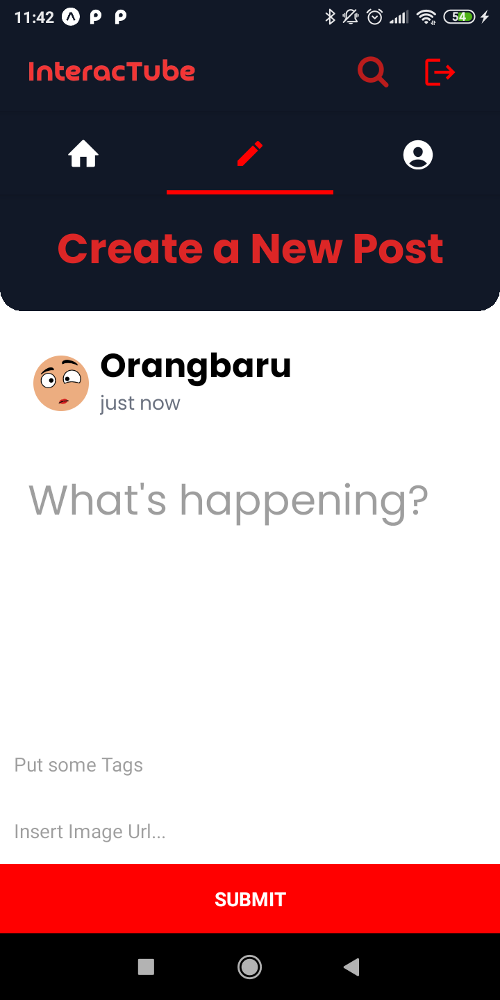

# InteracTube

    

InteracTube adalah sebuah aplikasi client(mobile)-server. Dimana menjadi sebuah pembelajaran bagi saya untuk membuat aplikasi mobile menggunakan React Native sebagai framework utamanya. Aplikasi ini menawarkan banyak fitur yang ditemukan pada sosial media pada umumnya, seperti memposting content, memberikan like pada suatu post, memberikan comment pada suatu post, memfollow pengguna yang lain, dan mencari pengguna lain.

# Tech Stacks
- React Native, Redis, Expo, GraphQL, Apollo Server, Apollo Client, MongoDB

# Struktur Folder

- Server: untuk menyimpan aplikasi server GraphQL
- Client: untuk menyimpan aplikasi mobile React Native

# Fitur

- Fitur Register
- Fitur Login
- FItur Add Post
- Fitur Show Post (berdasarkan yang paling baru)
- Fitur Comment Post (Embedded Document)
- Fitur search user berdasarkan nama atau username
- Fitur follow
- Menampilkan Followers dan Following dari setiap user (Reference with $lookup)
- Fitur Like Post
- Menampilkan total like dari setiap post

# Screenshots

Beberapa screenshot untuk aplikasi ini

## Register

    

## Login

    

## Home/Feed

    

    

## Liking Post

    

## Create a new Post

    

